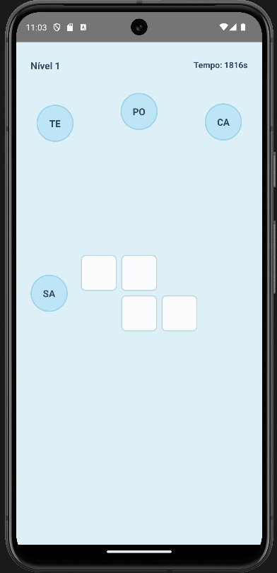

# Testes Funcionais – iClud

Este documento apresenta os testes funcionais manuais realizados no aplicativo iClud, com o objetivo de validar as principais funcionalidades implementadas, incluindo navegação, interação com as sílabas, progressão entre os níveis, sistema de pontuação e conclusão do jogo

Os cenários de teste foram estruturados utilizando a abordagem BDD (Behavior-Driven Development), com as palavras-chave Dado, Quando e Então

---

## CT01 – Acessar o primeiro nível do jogo

**Dado que** o aplicativo iClud está aberto na tela inicial  
**Quando** o usuário clicar no botão **INICIAR**  
**Então** o sistema deve abrir o **Nível 1** do jogo  
**E** deve exibir o cronômetro, a cruzadinha e as sílabas disponíveis

**Status:** Aprovado

**Evidência:**

  

---

## CT02 – Encaixar uma sílaba correta na cruzadinha

**Dado que** o usuário está no Nível 1 do jogo  
**E** existem sílabas disponíveis para interação  
**Quando** o usuário arrastar uma sílaba correta até o espaço correspondente  
**Então** a sílaba deve ser posicionada no espaço  
**E** o espaço deve mudar para a cor verde, indicando o acerto

**Status:** Aprovado

---

## CT03 – Rejeitar uma sílaba em posição incorreta

**Dado que** o usuário está no Nível 1 do jogo  
**E** existem sílabas disponíveis para interação  
**Quando** o usuário arrastar uma sílaba para um espaço que não corresponde a ela  
**Então** o sistema não deve aceitar a sílaba naquele espaço  
**E** o espaço não deve apresentar a coloração verde de acerto

**Status:** Aprovado

---

## CT04 – Concluir corretamente o Nível 1

**Dado que** o usuário está no Nível 1  
**E** ainda existem espaços não preenchidos na cruzadinha  
**Quando** o usuário encaixar corretamente todas as sílabas necessárias  
**Então** todas as palavras devem ser completadas  
**E** o aplicativo deve reconhecer a conclusão do nível  
**E** deve apresentar a tela de pontuação do Nível 1  
**E** deve exibir 70 pontos e 3 estrelas

**Status:** Aprovado

---

## CT05 – Avançar do Nível 1 para o Nível 2

**Dado que** o usuário concluiu o Nível 1  
**E** está na tela de pontuação  
**Quando** o usuário clicar no botão para avançar  
**Então** o aplicativo deve abrir o **Nível 2**  
**E** deve apresentar a nova cruzadinha e as sílabas correspondentes ao nível  
**E** o cronômetro deve funcionar normalmente

**Status:** Aprovado

---

## CT06 – Concluir corretamente o Nível 2

**Dado que** o usuário está no Nível 2  
**E** a cruzadinha e as sílabas estão disponíveis  
**Quando** o usuário encaixar corretamente todas as sílabas necessárias  
**Então** o aplicativo deve reconhecer a conclusão do nível  
**E** deve apresentar a tela de pontuação  
**E** deve exibir 80 pontos e 4 estrelas

**Status:** Aprovado

---

## CT07 – Avançar do Nível 2 para o Nível 3

**Dado que** o usuário concluiu o Nível 2  
**E** está na tela de pontuação  
**Quando** o usuário clicar no botão para avançar  
**Então** o aplicativo deve abrir o **Nível 3**  
**E** deve apresentar a cruzadinha e as sílabas correspondentes ao novo nível  
**E** o cronômetro deve funcionar normalmente

**Status:** Aprovado

---

## CT08 – Concluir corretamente o Nível 3

**Dado que** o usuário está no Nível 3  
**E** a cruzadinha e as sílabas estão disponíveis  
**Quando** o usuário encaixar corretamente todas as sílabas necessárias  
**Então** o aplicativo deve reconhecer a conclusão do nível  
**E** deve apresentar a tela de pontuação  
**E** deve exibir 90 pontos e 4 estrelas

**Status:** Aprovado

---

## CT09 – Avançar do Nível 3 para o Nível 4

**Dado que** o usuário concluiu o Nível 3  
**E** está na tela de pontuação  
**Quando** o usuário clicar no botão para avançar  
**Então** o aplicativo deve abrir o **Nível 4**  
**E** deve apresentar a cruzadinha e as sílabas correspondentes ao último nível  
**E** o cronômetro deve funcionar normalmente

**Status:** Aprovado

---

## CT10 – Concluir o Nível 4 e finalizar o jogo

**Dado que** o usuário está no Nível 4  
**E** a cruzadinha e as sílabas estão disponíveis  
**Quando** o usuário encaixar corretamente todas as sílabas necessárias  
**Então** o aplicativo deve reconhecer a conclusão do Nível 4  
**E** deve finalizar o fluxo de níveis  
**E** deve apresentar a mensagem **“Parabéns!”**  
**E** deve apresentar a mensagem **“Você completou o iClud!”**  
**E** deve disponibilizar o botão **VOLTAR AO MENU PRINCIPAL**

**Status:** Aprovado

---

## CT11 – Retornar ao menu principal após concluir o jogo

**Dado que** o usuário concluiu todos os níveis do iClud  
**E** está na tela final do jogo  
**Quando** o usuário clicar no botão **VOLTAR AO MENU PRINCIPAL**  
**Então** o aplicativo deve retornar para a tela inicial  
**E** deve permitir que um novo jogo seja iniciado

**Status:** Aprovado

---

## CT12 – Acessar a tela “Sobre o jogo”

**Dado que** o usuário está na tela inicial do iClud  
**Quando** o usuário clicar no botão **SOBRE O JOGO**  
**Então** o aplicativo deve abrir a tela informativa  
**E** deve apresentar corretamente as informações sobre o jogo  
**E** o aplicativo deve permanecer funcionando sem erros

**Status:** Aprovado

---

## CT13 – Retornar da tela “Sobre o jogo” para o menu principal

**Dado que** o usuário está na tela **Sobre o jogo**  
**Quando** o usuário utilizar a opção disponível para voltar  
**Então** o aplicativo deve retornar à tela inicial do iClud  
**E** os elementos do menu principal devem continuar disponíveis normalmente

**Status:** Aprovado

---

## CT14 – Iniciar uma nova partida após concluir o jogo

**Dado que** o usuário já concluiu uma partida anteriormente  
**E** retornou ao menu principal  
**Quando** o usuário clicar novamente no botão **INICIAR**  
**Então** o aplicativo deve iniciar uma nova partida no **Nível 1**  
**E** a cruzadinha deve estar em seu estado inicial  
**E** nenhuma sílaba da partida anterior deve permanecer preenchida  
**E** o cronômetro deve iniciar uma nova contagem

**Status:** Aprovado